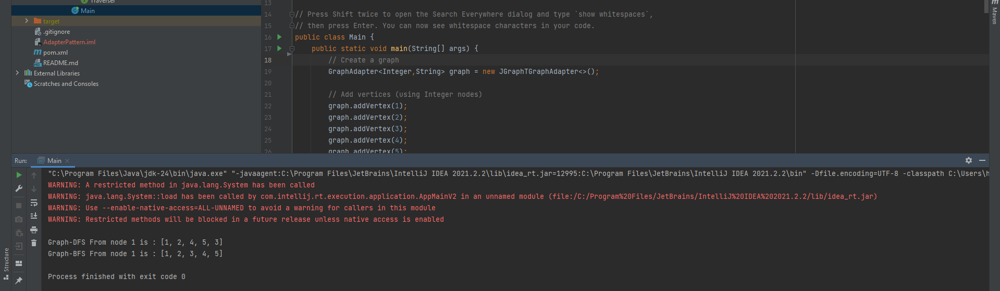
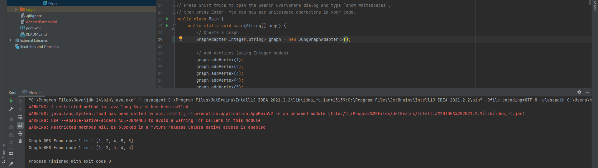

#گزارش نهایی آزمایش هشتم

## بخش اول - پیاده‌سازی الگوی Adapter

### انتخاب نوع Adapter

ما الگوی **Object Scope (Object Adapter)** را به جای Class Scope (Class Adapter) انتخاب کردم. دلایل ما به صورت زیر است:

1. **انعطاف‌پذیری**: الگوی Object Adapter به adapter ما اجازه می‌دهد تا با هر پیاده‌سازی گراف در زمان اجرا کار کند. می‌توانیم بین JUNG و JGraphT به سادگی با تغییر نمونه‌ای که از adapter می‌سازیم جابجا شویم، بدون اینکه نیاز به تغییر کد دیگری باشد.

2. **محدودیت‌های جاوا**: جاوا از وراثت چندگانه پشتیبانی نمی‌کند، که برای Class Adapter لازم است تا هم از interface GraphAdapter و هم از کلاس concrete گراف (مانند SparseMultigraph) ارث‌بری کند. استفاده از ترکیب (composition) به جای وراثت تنها گزینه ممکن در جاوا است.

3. **کپسوله‌سازی**: Object Adapter کتابخانه گراف زیرین را بهتر کپسوله می‌کند. کلاس‌های traverser فقط از interface GraphAdapter اطلاع دارند، نه از جزئیات پیاده‌سازی خاص JUNG یا JGraphT.

### زیربخش ۲ - نحوه پیاده‌سازی الگو

الگوی Adapter از طریق رویکرد زیر پیاده‌سازی شد:

1. **تعریف Interface**: یک interface به نام `GraphAdapter<V,E>` ایجاد کردم که عملیات‌های ضروری گراف مورد نیاز traverserها را انتزاعی می‌کند: افزودن رأس‌ها، افزودن یال‌ها، دریافت همسایه‌ها و دریافت همه رأس‌ها.

2. **Adapterهای Concrete**: دو کلاس adapter concrete پیاده‌سازی کردم:
    - `JungGraphAdapter`: SparseMultigraph از JUNG را wrap می‌کند و فراخوانی‌ها را به آن واگذار می‌کند
    - `JGraphTGraphAdapter`: SimpleGraph از JGraphT را wrap می‌کند و عملیات را ترجمه می‌کند

3. **تغییر Client**: کلاس‌های traverser را به‌روزرسانی کردم تا به interface GraphAdapter وابسته باشند به جای استفاده مستقیم از کلاس‌های JUNG. این جداسازی تضمین می‌کند که تغییر کتابخانه‌ها فقط نیاز به تغییر نمونه‌سازی adapter در Main دارد.

## بخش دوم - تغییر کتابخانه

###  نحوه تغییر کتابخانه

تغییر کتابخانه با حداقل تغییر کد انجام شد:

1. **نقطه تغییر واحد**: فقط کلاس Main نیاز به تغییر داشت - به طور خاص فقط یک خط که در آن adapter را نمونه‌سازی می‌کنیم:
   ```java
    \\from:
   GraphAdapter<Integer, String> graphAdapter = new JungGraphAdapter<>();
    \\to:
   GraphAdapter<Integer, String> graphAdapter = new JGraphTGraphAdapter<>();
   ```

2. **عدم تغییر الگوریتم‌ها**: پیاده‌سازی‌های traverser برای BFS و DFS کاملاً بدون تغییر باقی ماندند، که اثربخشی الگوی Adapter را نشان می‌دهد.

3. **Interface یکسان**: همه عملیات گراف (افزودن رأس‌ها، یال‌ها، پیمایش) از دیدگاه client به طور یکسان کار می‌کنند.

### مهاجرت از JUNG به JGraphT

تفاوت‌های کلیدی که در طول مهاجرت مواجه شدم:

1. **مدیریت یال‌ها**:
    - JUNG اجازه می‌دهد یال‌های برچسب‌دار با اشیاء یال صریح داشته باشیم
    - SimpleGraph در JGraphT از DefaultEdge استفاده می‌کند که برچسب را ذخیره نمی‌کند
    - راه‌حل: برای این پیاده‌سازی، برچسب‌های یال در adapter JGraphT نادیده گرفته می‌شوند

2. **ساخت گراف**:
    - JUNG: `new SparseMultigraph<>()`
    - JGraphT: `new SimpleGraph<>(DefaultEdge.class)` - نیاز به مشخص کردن کلاس یال دارد

3. **بازیابی همسایه‌ها**:
    - JUNG: متد مستقیم `graph.getNeighbors(vertex)`
    - JGraphT: باید از طریق یال‌ها تکرار کرده و رأس دیگر را به صورت دستی استخراج کنیم

4. **تفاوت‌های API**:
    - JUNG: از `addVertex()` و `addEdge(edge, v1, v2)` استفاده می‌کند
    - JGraphT: از `addVertex()` و `addEdge(v1, v2)` استفاده می‌کند (شیء یال را برمی‌گرداند)

## بخش سوم - تحلیل الگوی Strategy

### ۱. دلیل استفاده از الگوی Strategy در این زمینه چیست؟

الگوی Strategy در اینجا برای کپسوله کردن الگوریتم‌های مختلف پیمایش گراف (BFS و DFS) و قابل تعویض کردن آن‌ها استفاده می‌شود. این به کد client اجازه می‌دهد که الگوریتم پیمایش را در زمان اجرا انتخاب کند بدون تغییر ساختار گراف یا منطق اصلی برنامه. این الگو اصل Open/Closed را ترویج می‌دهد - سیستم برای توسعه باز است (استراتژی‌های پیمایش جدید) اما برای تغییر بسته است.

### ۲. این الگو چگونه پیاده‌سازی شده است؟

الگوی Strategy از طریق سه جزء پیاده‌سازی شده است: (۱) interface `Traverser` قرارداد را برای همه استراتژی‌های پیمایش با متد `traverse()` تعریف می‌کند، (۲) `BfsGraphTraverser` و `DfsGraphTraverser` استراتژی‌های concrete هستند که interface را با الگوریتم‌های خاص خود پیاده‌سازی می‌کنند، و (۳) کلاس Main به عنوان context عمل می‌کند و انتخاب می‌کند که کدام استراتژی در زمان اجرا استفاده شود.
## نتایج 
همانطور که میبینیم تنها با تغییر یک خط کد که مربوط به adapter می باشد نتیجه یکسان و درست را می گیریم


## نتیجه‌گیری

ترکیب الگوهای Adapter و Strategy یک سیستم بسیار انعطاف‌پذیر و قابل نگهداری ایجاد می‌کند. الگوی Adapter با موفقیت وابستگی به کتابخانه گراف را جدا کرد و امکان مهاجرت بدون درز از JUNG به JGraphT را با حداقل تغییرات کد فراهم کرد. الگوی Strategy امکان افزودن آسان الگوریتم‌های پیمایش جدید را بدون تغییر کد موجود فراهم می‌کند. این طراحی اصول کلیدی مهندسی نرم‌افزار از جمله اتصال سست (loose coupling)، انسجام بالا (high cohesion) و پایبندی به اصول SOLID را نشان می‌دهد.